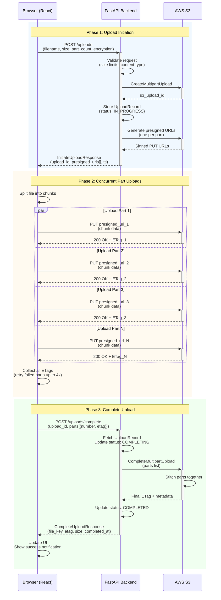

# S3 Multipart Upload Service

A full-stack application for secure, scalable large-file uploads using AWS S3 multipart upload with presigned URLs.

## Architecture Overview

- **Frontend**: React + Vite SPA with Zustand state management
- **Backend**: FastAPI with async S3 operations (aioboto3)
- **Storage**: AWS S3 (or LocalStack for local development)

## Interaction Sequence Diagram



## Key Features

- **Direct S3 uploads** - File data goes directly to S3, not through the backend
- **Concurrent uploads** - Multiple parts upload in parallel (default: 4)
- **Automatic retries** - Failed parts retry up to 4 times with exponential backoff
- **URL refresh** - Expired presigned URLs can be refreshed without restarting
- **Dual authentication** - Supports both JWT and API Key authentication
- **Encryption support** - SSE-S3 and SSE-KMS encryption options

## Project Structure

```
multipart/
├── s3_upload_api/           # FastAPI backend
│   ├── app/
│   │   ├── main.py          # App setup, middleware
│   │   ├── config.py        # Environment settings
│   │   ├── routers/         # API endpoints
│   │   └── services/        # S3 and storage services
│   └── docker-compose.yml   # LocalStack setup
│
└── upload-ui/               # React frontend
    ├── src/
    │   ├── pages/           # NewUpload, ActiveUploads, History
    │   ├── services/api.js  # Upload orchestration
    │   └── store/           # Zustand state management
    └── package.json
```

## API Endpoints

| Method | Endpoint | Description |
|--------|----------|-------------|
| POST | `/uploads` | Initiate multipart upload |
| POST | `/uploads/complete` | Complete multipart upload |
| GET | `/uploads/{id}/status` | Get upload status |
| GET | `/uploads/list-active` | List active uploads |
| GET | `/uploads/{id}/part/{n}/refresh` | Refresh presigned URL |
| DELETE | `/uploads/{id}` | Abort upload |

## Getting Started

### Local Development with LocalStack

```bash
# Start LocalStack and API
cd s3_upload_api
docker-compose up -d

# Start frontend
cd upload-ui
npm install
npm run dev
```

### Environment Variables

**Backend** (`s3_upload_api/.env`):
```
AWS_REGION=eu-west-1
AWS_ENDPOINT_URL=http://localhost:4566
S3_BUCKET=co-uploads-dev
JWT_SECRET=your-secret-key
API_KEYS=devkey-1,devkey-2
```

**Frontend** (`upload-ui/.env`):
```
VITE_API_BASE=http://localhost:8000
```
