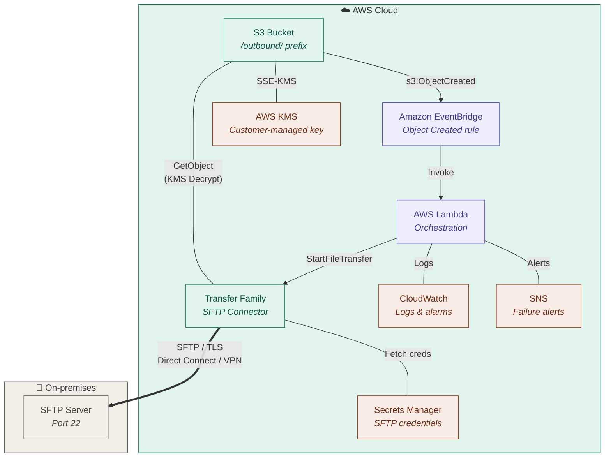
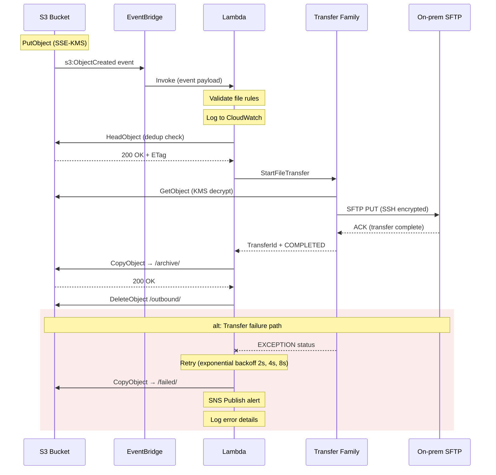

# Pushing files from S3 to on-prem servers using AWS Transfer Family

> **Status:** Published · **Owner:** Cloud Infrastructure Team · **Last updated:** 02 Apr 2026

*Engineering › Cloud Infrastructure › Data Transfer*

---

## Table of contents

- [Overview](#overview)
- [Architecture & data flow](#architecture--data-flow)
- [Architecture diagram](#architecture-diagram)
- [Sequence interaction diagram](#sequence-interaction-diagram)
- [S3 event notifications & EventBridge](#s3-event-notifications--eventbridge)
- [AWS Transfer Family configuration](#aws-transfer-family-configuration)
- [Security & access control](#security--access-control)
- [Encryption (in-transit & at-rest)](#encryption-in-transit--at-rest)
- [Logging, monitoring & alerting](#logging-monitoring--alerting)
- [Error handling & retry strategy](#error-handling--retry-strategy)
- [Prerequisites & setup checklist](#prerequisites--setup-checklist)
- [Related resources](#related-resources)

---

## Overview

This page documents the pattern for automatically pushing newly uploaded files from an Amazon S3 bucket to an on-premises (on-prem) SFTP or FTPS server. The integration is event-driven: when an object lands in S3, an event triggers a workflow that uses **AWS Transfer Family** connectors to deliver the file to the on-prem endpoint over a secure channel.

> **ℹ️ Key components**
>
> - **Amazon S3** — source bucket where files are uploaded.
> - **S3 Event Notifications / Amazon EventBridge** — captures `PutObject` events and routes them.
> - **AWS Lambda** — orchestration function that calls the Transfer Family connector.
> - **AWS Transfer Family (SFTP connector)** — managed connector that pushes the file to the on-prem server via SFTP/FTPS.
> - **On-prem SFTP server** — destination endpoint accessible over AWS Direct Connect or Site-to-Site VPN.

---

## Architecture & data flow

The end-to-end flow is fully event-driven with no polling or scheduled jobs. A file landing in S3 triggers delivery within seconds.

1. An upstream application or ETL pipeline uploads a file to the designated S3 bucket (prefix: `/outbound/`).
2. S3 emits a `s3:ObjectCreated:*` event. This is routed either directly via **S3 Event Notifications** to a Lambda function, or via **Amazon EventBridge** for richer filtering and fan-out.
3. The Lambda function receives the event payload (bucket, key, size, etag), validates the file against business rules (naming convention, size limits), and invokes the **AWS Transfer Family `StartFileTransfer`** API.
4. Transfer Family's SFTP connector pulls the file from S3 and pushes it to the on-prem server over **SFTP/FTPS**, traversing a **Direct Connect** or **Site-to-Site VPN** link.
5. On success, the Lambda moves the S3 object to an `/archive/` prefix. On failure, it moves it to `/failed/` and publishes an SNS alert.

> ⚠️ **Important:** The Transfer Family SFTP connector initiates an *outbound* connection to the on-prem server. The on-prem firewall must allow inbound SFTP (port 22) or FTPS (port 990/21) from the NAT gateway or VPC endpoint IP range used by the connector.

---

## Architecture diagram

*Fig 1 — High-level architecture: S3 to on-prem via Transfer Family*



**Embedded SVG (for environments without Mermaid support):**

<p align="center">
<svg width="100%" viewBox="0 0 720 530" xmlns="http://www.w3.org/2000/svg" style="max-width:720px;font-family:-apple-system,BlinkMacSystemFont,Segoe UI,Roboto,sans-serif;">
  <defs>
    <marker id="a1" viewBox="0 0 10 10" refX="8" refY="5" markerWidth="6" markerHeight="6" orient="auto-start-reverse">
      <path d="M2 1L8 5L2 9" fill="none" stroke="context-stroke" stroke-width="1.5" stroke-linecap="round" stroke-linejoin="round"/>
    </marker>
  </defs>
  <rect x="30" y="20" width="460" height="490" rx="20" fill="#e1f5ee" stroke="#0f6e56" stroke-width="0.5"/>
  <text x="260" y="50" text-anchor="middle" font-size="14" font-weight="600" fill="#085041">AWS cloud</text>
  <rect x="540" y="20" width="150" height="490" rx="20" fill="#f1efe8" stroke="#5f5e5a" stroke-width="0.5"/>
  <text x="615" y="50" text-anchor="middle" font-size="14" font-weight="600" fill="#444441">On-prem</text>
  <rect x="70" y="80" width="170" height="56" rx="8" fill="#e1f5ee" stroke="#0f6e56" stroke-width="0.5"/>
  <text x="155" y="102" text-anchor="middle" font-size="14" font-weight="600" fill="#085041">S3 bucket</text>
  <text x="155" y="120" text-anchor="middle" font-size="12" fill="#085041" opacity=".7">/outbound/ prefix</text>
  <rect x="70" y="196" width="170" height="56" rx="8" fill="#eeedfe" stroke="#534ab7" stroke-width="0.5"/>
  <text x="155" y="218" text-anchor="middle" font-size="14" font-weight="600" fill="#3c3489">EventBridge</text>
  <text x="155" y="236" text-anchor="middle" font-size="12" fill="#3c3489" opacity=".7">Object created rule</text>
  <rect x="70" y="312" width="170" height="56" rx="8" fill="#eeedfe" stroke="#534ab7" stroke-width="0.5"/>
  <text x="155" y="334" text-anchor="middle" font-size="14" font-weight="600" fill="#3c3489">Lambda</text>
  <text x="155" y="352" text-anchor="middle" font-size="12" fill="#3c3489" opacity=".7">Orchestration</text>
  <rect x="70" y="428" width="170" height="56" rx="8" fill="#e1f5ee" stroke="#0f6e56" stroke-width="0.5"/>
  <text x="155" y="450" text-anchor="middle" font-size="14" font-weight="600" fill="#085041">Transfer Family</text>
  <text x="155" y="468" text-anchor="middle" font-size="12" fill="#085041" opacity=".7">SFTP connector</text>
  <rect x="300" y="398" width="160" height="44" rx="8" fill="#faece7" stroke="#993c1d" stroke-width="0.5"/>
  <text x="380" y="424" text-anchor="middle" font-size="14" font-weight="600" fill="#712b13">Secrets Manager</text>
  <rect x="300" y="80" width="160" height="44" rx="8" fill="#faece7" stroke="#993c1d" stroke-width="0.5"/>
  <text x="380" y="106" text-anchor="middle" font-size="14" font-weight="600" fill="#712b13">KMS</text>
  <rect x="300" y="196" width="160" height="44" rx="8" fill="#faece7" stroke="#993c1d" stroke-width="0.5"/>
  <text x="380" y="222" text-anchor="middle" font-size="14" font-weight="600" fill="#712b13">CloudWatch</text>
  <rect x="300" y="300" width="160" height="44" rx="8" fill="#faece7" stroke="#993c1d" stroke-width="0.5"/>
  <text x="380" y="326" text-anchor="middle" font-size="14" font-weight="600" fill="#712b13">SNS alerts</text>
  <rect x="555" y="268" width="120" height="56" rx="8" fill="#f1efe8" stroke="#5f5e5a" stroke-width="0.5"/>
  <text x="615" y="290" text-anchor="middle" font-size="14" font-weight="600" fill="#444441">SFTP server</text>
  <text x="615" y="308" text-anchor="middle" font-size="12" fill="#444441" opacity=".7">Port 22</text>
  <rect x="555" y="176" width="120" height="44" rx="8" fill="none" stroke="#888" stroke-width="0.5" stroke-dasharray="4 3"/>
  <text x="615" y="194" text-anchor="middle" font-size="12" fill="#888">Direct Connect</text>
  <text x="615" y="210" text-anchor="middle" font-size="12" fill="#888">/ VPN</text>
  <text x="205" y="158" font-size="11" fill="#888">s3:ObjectCreated</text>
  <line x1="155" y1="136" x2="155" y2="188" stroke="#888" stroke-width="1" fill="none" marker-end="url(#a1)"/>
  <text x="205" y="276" font-size="11" fill="#888">Invoke</text>
  <line x1="155" y1="252" x2="155" y2="304" stroke="#888" stroke-width="1" fill="none" marker-end="url(#a1)"/>
  <text x="178" y="392" font-size="11" fill="#888">StartFileTransfer</text>
  <line x1="155" y1="368" x2="155" y2="420" stroke="#888" stroke-width="1" fill="none" marker-end="url(#a1)"/>
  <path d="M240 456 L510 456 L510 296 L547 296" fill="none" stroke="#888" stroke-width="1" marker-end="url(#a1)"/>
  <text x="512" y="380" font-size="11" fill="#888">SFTP / TLS</text>
  <line x1="240" y1="326" x2="292" y2="326" stroke="#888" stroke-width="1" fill="none" marker-end="url(#a1)"/>
  <path d="M240 334 L265 334 L265 218 L292 218" fill="none" stroke="#888" stroke-width="1" marker-end="url(#a1)"/>
  <path d="M240 450 L265 450 L265 420 L292 420" fill="none" stroke="#888" stroke-width="1" marker-end="url(#a1)"/>
  <line x1="240" y1="102" x2="292" y2="102" stroke="#888" stroke-width="1" fill="none" marker-end="url(#a1)"/>
  <text x="250" y="94" font-size="11" fill="#888">SSE-KMS</text>
</svg>
</p>

---

## Sequence interaction diagram

*Fig 2 — Sequence: file transfer lifecycle (happy path + failure)*



**Embedded SVG (for environments without Mermaid support):**

<p align="center">
<svg width="100%" viewBox="0 0 720 920" xmlns="http://www.w3.org/2000/svg" style="max-width:720px;font-family:-apple-system,BlinkMacSystemFont,Segoe UI,Roboto,sans-serif;">
  <defs>
    <marker id="a2" viewBox="0 0 10 10" refX="8" refY="5" markerWidth="5" markerHeight="5" orient="auto-start-reverse">
      <path d="M2 1L8 5L2 9" fill="none" stroke="context-stroke" stroke-width="1.5" stroke-linecap="round" stroke-linejoin="round"/>
    </marker>
  </defs>
  <rect x="30" y="10" width="90" height="36" rx="6" fill="#e1f5ee" stroke="#0f6e56" stroke-width="0.5"/>
  <text x="75" y="32" text-anchor="middle" font-size="14" font-weight="600" fill="#085041">S3</text>
  <rect x="170" y="10" width="110" height="36" rx="6" fill="#eeedfe" stroke="#534ab7" stroke-width="0.5"/>
  <text x="225" y="32" text-anchor="middle" font-size="14" font-weight="600" fill="#3c3489">EventBridge</text>
  <rect x="330" y="10" width="90" height="36" rx="6" fill="#eeedfe" stroke="#534ab7" stroke-width="0.5"/>
  <text x="375" y="32" text-anchor="middle" font-size="14" font-weight="600" fill="#3c3489">Lambda</text>
  <rect x="470" y="10" width="100" height="36" rx="6" fill="#e1f5ee" stroke="#0f6e56" stroke-width="0.5"/>
  <text x="520" y="32" text-anchor="middle" font-size="14" font-weight="600" fill="#085041">Transfer Fam.</text>
  <rect x="620" y="10" width="70" height="36" rx="6" fill="#f1efe8" stroke="#5f5e5a" stroke-width="0.5"/>
  <text x="655" y="32" text-anchor="middle" font-size="14" font-weight="600" fill="#444441">On-prem</text>
  <line x1="75" y1="46" x2="75" y2="900" stroke="#ddd" stroke-width="0.5" stroke-dasharray="4 3"/>
  <line x1="225" y1="46" x2="225" y2="900" stroke="#ddd" stroke-width="0.5" stroke-dasharray="4 3"/>
  <line x1="375" y1="46" x2="375" y2="900" stroke="#ddd" stroke-width="0.5" stroke-dasharray="4 3"/>
  <line x1="520" y1="46" x2="520" y2="900" stroke="#ddd" stroke-width="0.5" stroke-dasharray="4 3"/>
  <line x1="655" y1="46" x2="655" y2="900" stroke="#ddd" stroke-width="0.5" stroke-dasharray="4 3"/>
  <rect x="71" y="70" width="8" height="40" rx="2" fill="#e6f1fb"/>
  <rect x="221" y="120" width="8" height="40" rx="2" fill="#e6f1fb"/>
  <rect x="371" y="170" width="8" height="460" rx="2" fill="#e6f1fb"/>
  <rect x="516" y="380" width="8" height="160" rx="2" fill="#e6f1fb"/>
  <rect x="651" y="420" width="8" height="100" rx="2" fill="#e6f1fb"/>
  <text x="78" y="80" font-size="11" fill="#888">PutObject (SSE-KMS)</text>
  <line x1="79" y1="97" x2="217" y2="132" stroke="#185fa5" stroke-width="0.5" marker-end="url(#a2)"/>
  <text x="110" y="110" font-size="11" fill="#888">s3:ObjectCreated</text>
  <line x1="229" y1="147" x2="367" y2="182" stroke="#185fa5" stroke-width="0.5" marker-end="url(#a2)"/>
  <text x="256" y="160" font-size="11" fill="#888">Invoke (event payload)</text>
  <rect x="358" y="197" width="140" height="28" rx="4" fill="#f7f6f3" stroke="#e0dfda" stroke-width="0.5"/>
  <text x="428" y="215" text-anchor="middle" font-size="11" fill="#888">Validate file rules</text>
  <rect x="358" y="240" width="140" height="28" rx="4" fill="#f7f6f3" stroke="#e0dfda" stroke-width="0.5"/>
  <text x="428" y="258" text-anchor="middle" font-size="11" fill="#888">Log to CloudWatch</text>
  <line x1="371" y1="290" x2="83" y2="290" stroke="#185fa5" stroke-width="0.5" marker-end="url(#a2)"/>
  <text x="140" y="283" font-size="11" fill="#888">HeadObject (dedup check)</text>
  <line x1="79" y1="310" x2="367" y2="310" stroke="#3b6d11" stroke-width="0.5" stroke-dasharray="4 2" marker-end="url(#a2)"/>
  <text x="140" y="327" font-size="11" fill="#888">200 OK + ETag</text>
  <line x1="379" y1="390" x2="512" y2="390" stroke="#185fa5" stroke-width="0.5" marker-end="url(#a2)"/>
  <text x="394" y="383" font-size="11" fill="#888">StartFileTransfer</text>
  <line x1="516" y1="410" x2="83" y2="410" stroke="#185fa5" stroke-width="0.5" marker-end="url(#a2)"/>
  <text x="210" y="403" font-size="11" fill="#888">GetObject (KMS decrypt)</text>
  <line x1="524" y1="440" x2="647" y2="440" stroke="#185fa5" stroke-width="0.5" marker-end="url(#a2)"/>
  <text x="548" y="433" font-size="11" fill="#888">SFTP PUT (SSH)</text>
  <line x1="651" y1="500" x2="524" y2="500" stroke="#3b6d11" stroke-width="0.5" stroke-dasharray="4 2" marker-end="url(#a2)"/>
  <text x="556" y="517" font-size="11" fill="#888">ACK</text>
  <line x1="516" y1="540" x2="383" y2="540" stroke="#3b6d11" stroke-width="0.5" stroke-dasharray="4 2" marker-end="url(#a2)"/>
  <text x="405" y="557" font-size="11" fill="#888">COMPLETED</text>
  <line x1="371" y1="580" x2="83" y2="580" stroke="#185fa5" stroke-width="0.5" marker-end="url(#a2)"/>
  <text x="140" y="573" font-size="11" fill="#888">CopyObject → /archive/</text>
  <line x1="79" y1="600" x2="367" y2="600" stroke="#3b6d11" stroke-width="0.5" stroke-dasharray="4 2" marker-end="url(#a2)"/>
  <text x="140" y="617" font-size="11" fill="#888">200 OK</text>
  <line x1="371" y1="632" x2="83" y2="632" stroke="#185fa5" stroke-width="0.5" marker-end="url(#a2)"/>
  <text x="140" y="647" font-size="11" fill="#888">DeleteObject /outbound/</text>
  <rect x="40" y="680" width="650" height="26" rx="4" fill="#fcebeb"/>
  <text x="365" y="697" text-anchor="middle" font-size="11" fill="#a32d2d">alt: transfer failure path</text>
  <line x1="516" y1="730" x2="383" y2="730" stroke="#a32d2d" stroke-width="0.5" stroke-dasharray="4 2" marker-end="url(#a2)"/>
  <text x="405" y="747" font-size="11" fill="#a32d2d">EXCEPTION status</text>
  <rect x="358" y="760" width="140" height="28" rx="4" fill="#faeeda" stroke="#e0dfda" stroke-width="0.5"/>
  <text x="428" y="778" text-anchor="middle" font-size="11" fill="#888">Retry (exp. backoff)</text>
  <line x1="371" y1="810" x2="83" y2="810" stroke="#a32d2d" stroke-width="0.5" stroke-dasharray="4 2" marker-end="url(#a2)"/>
  <text x="140" y="803" font-size="11" fill="#a32d2d">CopyObject → /failed/</text>
  <rect x="358" y="840" width="140" height="28" rx="4" fill="#fcebeb" stroke="#e0dfda" stroke-width="0.5"/>
  <text x="428" y="858" text-anchor="middle" font-size="11" fill="#888">SNS publish alert</text>
  <rect x="358" y="880" width="140" height="14" rx="4" fill="#f7f6f3" stroke="#e0dfda" stroke-width="0.5"/>
  <text x="428" y="891" text-anchor="middle" font-size="11" fill="#888">Log error details</text>
</svg>
</p>

---

## S3 event notifications & EventBridge

You can route S3 events in two ways. Choose based on your needs:

| Approach | When to use | Trade-offs |
|---|---|---|
| **S3 Event Notifications → Lambda** | Simple, single-consumer pipeline. One bucket, one destination. | Fast and simple. Limited filtering (prefix/suffix only). No replay. No fan-out without extra infra. |
| **S3 → EventBridge → Lambda** | Multiple consumers, content-based routing, audit trail, replay. | Richer filtering rules (object metadata, size, tags). Built-in archive & replay. Fan-out to multiple targets. Slight added latency (~1–2s). |

### EventBridge rule example

Enable EventBridge notifications on the S3 bucket, then create a rule that matches new objects in the `/outbound/` prefix:

```json
{
  "source": ["aws.s3"],
  "detail-type": ["Object Created"],
  "detail": {
    "bucket": { "name": ["my-file-bucket"] },
    "object": {
      "key": [{ "prefix": "outbound/" }]
    }
  }
}
```

The rule target is the orchestration Lambda function. EventBridge handles retry and dead-letter queuing natively.

> **💡 Tip:** If you use EventBridge, enable the **EventBridge archive** on the rule. This lets you replay missed events during incident recovery without re-uploading files.

---

## AWS Transfer Family configuration

AWS Transfer Family provides a managed SFTP connector that handles the outbound file push. No self-managed SFTP client libraries or EC2 instances are needed.

### Connector setup

Create an SFTP connector resource pointing at the on-prem server:

```json
{
  "Url": "sftp://sftp.corp.example.com",
  "AccessRole": "arn:aws:iam::123456789012:role/TransferConnectorRole",
  "SftpConfig": {
    "TrustedHostKeys": [
      "ssh-ed25519 AAAAC3Nza..."
    ],
    "UserSecretId": "arn:aws:secretsmanager:eu-west-1:123456789012:secret:sftp-onprem-creds"
  }
}
```

### Lambda invocation

The orchestration Lambda calls `StartFileTransfer` on the connector:

```python
import boto3

transfer = boto3.client('transfer')

response = transfer.start_file_transfer(
    ConnectorId='c-0abc1234def56789',
    SendFilePaths=['/my-file-bucket/outbound/invoice_2026.csv'],
    RetrieveFilePaths=[]   # empty — we are pushing, not pulling
)
```

The API returns a `TransferId` that you can poll or monitor via CloudWatch for completion status.

---

## Security & access control

### IAM policies (least privilege)

| Principal | Permissions |
|---|---|
| **Lambda execution role** | `s3:GetObject`, `s3:PutObject` (for archiving), `transfer:StartFileTransfer`, `transfer:DescribeExecution`, `secretsmanager:GetSecretValue` (scoped to SFTP secret), `sns:Publish` |
| **Transfer Family connector role** | `s3:GetObject`, `s3:GetObjectVersion` on the source bucket & prefix only. **No write access.** |

> 🔴 **Security requirement:** Never embed SFTP credentials in Lambda code or environment variables. Store them in **AWS Secrets Manager** and reference the secret ARN in the connector config. Rotate credentials automatically on a 90-day schedule.

### Network security

- ✅ Transfer Family connector runs inside your **VPC** with security groups restricting outbound to the on-prem SFTP IP and port only.
- ✅ On-prem connectivity is via **AWS Direct Connect** (preferred) or **Site-to-Site VPN** — never over the public internet.
- ✅ Security groups on the connector's ENI allow egress to port 22 (SFTP) or 990 (FTPS) on the on-prem IP only.
- ✅ S3 bucket policy restricts access to the Lambda role and Transfer Family role ARNs; deny all other principals.
- ✅ Enable **S3 VPC endpoint** (gateway type) so Transfer Family reads from S3 without traversing the internet.

### Host key verification

The connector config includes `TrustedHostKeys` — the on-prem server's SSH public key fingerprint. Transfer Family verifies the host key on every connection, preventing MITM attacks. If the on-prem server rotates its host key, update the connector config before the change to avoid transfer failures.

---

## Encryption (in-transit & at-rest)

| Layer | Mechanism | Details |
|---|---|---|
| **At-rest (S3)** | SSE-KMS | All objects encrypted with a customer-managed KMS key. Bucket policy enforces `aws:kms` encryption on every `PutObject` request. The Transfer Family connector role has `kms:Decrypt` permission on the key. |
| **In-transit (S3 → Transfer Family)** | TLS 1.2+ | S3 API calls over HTTPS. Enforce with bucket policy condition `"aws:SecureTransport": "true"`. |
| **In-transit (Transfer Family → on-prem)** | SFTP (SSH) / FTPS (TLS) | SFTP encrypts the channel with SSH. FTPS uses TLS 1.2+. Both protect data and credentials in transit over Direct Connect / VPN. |
| **Secrets** | Secrets Manager + KMS | SFTP credentials encrypted at rest in Secrets Manager using a separate KMS key. Access scoped to the connector role only. |

> ✅ **Best practice:** Use a **dedicated KMS key** for this pipeline (not the AWS-managed `aws/s3` key). This lets you audit decrypt operations in CloudTrail independently and revoke access instantly if the pipeline is compromised.

---

## Logging, monitoring & alerting

### Logging sources

| Source | What it captures | Where it goes |
|---|---|---|
| **S3 server access logs** | All API calls against the bucket (who uploaded what, when) | Separate logging bucket |
| **CloudTrail (data events)** | `GetObject`, `PutObject`, KMS `Decrypt` calls — full audit trail | CloudTrail S3 bucket + CloudWatch Logs |
| **Transfer Family structured logs** | Connector execution status, bytes transferred, duration, errors, remote server response codes | CloudWatch Logs (`/aws/transfer/` log group) |
| **Lambda function logs** | Orchestration logic, validation results, StartFileTransfer calls, error traces | CloudWatch Logs (`/aws/lambda/` log group) |
| **EventBridge** | Rule invocation metrics, DLQ entries for failed deliveries | CloudWatch Metrics + DLQ (SQS) |

### CloudWatch alarms

Set up the following alarms and route them to an SNS topic connected to your on-call channel (PagerDuty / Slack):

| Alarm | Metric / condition | Threshold |
|---|---|---|
| Transfer failure | Transfer Family connector execution status = `EXCEPTION` | Any occurrence |
| Lambda errors | `Errors` metric on the Lambda function | > 0 in 5 min |
| Stale queue | Age of oldest message in EventBridge DLQ | > 15 min |
| Transfer latency | Transfer duration exceeds baseline | > 5 min per file |

### Sample CloudWatch alarm (Terraform)

```hcl
resource "aws_cloudwatch_metric_alarm" "transfer_failures" {
  alarm_name          = "s3-to-onprem-transfer-failure"
  comparison_operator = "GreaterThanThreshold"
  evaluation_periods  = 1
  metric_name         = "FilesTransferredErrors"
  namespace           = "AWS/Transfer"
  period              = 300
  statistic           = "Sum"
  threshold           = 0

  dimensions = {
    ConnectorId = aws_transfer_connector.onprem.id
  }

  alarm_actions = [aws_sns_topic.alerts.arn]
}
```

---

## Error handling & retry strategy

### Retry layers

| Layer | Retry behaviour |
|---|---|
| **EventBridge → Lambda** | EventBridge retries for 24 hours with exponential backoff. Failed events go to a configured SQS dead-letter queue. |
| **Lambda → Transfer Family** | The Lambda implements 3 retries with exponential backoff (2s, 4s, 8s) before marking the transfer as failed. |
| **Transfer Family → on-prem** | The managed connector retries the SFTP connection up to 3 times internally. Connection timeouts, auth failures, and disk-full errors on the remote side are surfaced in the execution status. |

### Dead-letter handling

Files that fail all retry attempts are moved to the `/failed/` S3 prefix with metadata tags recording the failure reason and timestamp. A scheduled Lambda runs daily to report on the failed prefix and optionally re-queue files for retry after the root cause is resolved.

> ⚠️ **Idempotency:** The Lambda must be idempotent. If EventBridge delivers the same event twice (at-least-once delivery), the function should check whether the file has already been archived before initiating another transfer. Use the S3 object's ETag or a DynamoDB deduplication table.

---

## Prerequisites & setup checklist

- [ ] S3 bucket created with SSE-KMS encryption, versioning enabled, and EventBridge notifications turned on.
- [ ] AWS Transfer Family SFTP connector created in the target VPC with the on-prem host key registered.
- [ ] SFTP credentials stored in Secrets Manager with automatic 90-day rotation.
- [ ] Direct Connect or Site-to-Site VPN link verified and stable between AWS VPC and on-prem network.
- [ ] On-prem firewall rules allow inbound SFTP from the connector's NAT/ENI IP range.
- [ ] IAM roles created with least-privilege policies for Lambda and Transfer Family.
- [ ] EventBridge rule (or S3 event notification) configured with DLQ.
- [ ] CloudWatch alarms and SNS topic configured for failure notifications.
- [ ] CloudTrail data events enabled on the S3 bucket for audit compliance.
- [ ] Transfer Family structured logging enabled to CloudWatch Logs.
- [ ] End-to-end test completed with a sample file from upload to on-prem delivery.

---

## Related resources

- [AWS Transfer Family — SFTP Connectors](https://docs.aws.amazon.com/transfer/latest/userguide/connectors-sftp.html)
- [Amazon S3 Event Notifications with EventBridge](https://docs.aws.amazon.com/AmazonS3/latest/userguide/EventBridge.html)
- [StartFileTransfer API reference](https://docs.aws.amazon.com/transfer/latest/userguide/API_StartFileTransfer.html)
- Corporate network connectivity runbook (Direct Connect)
